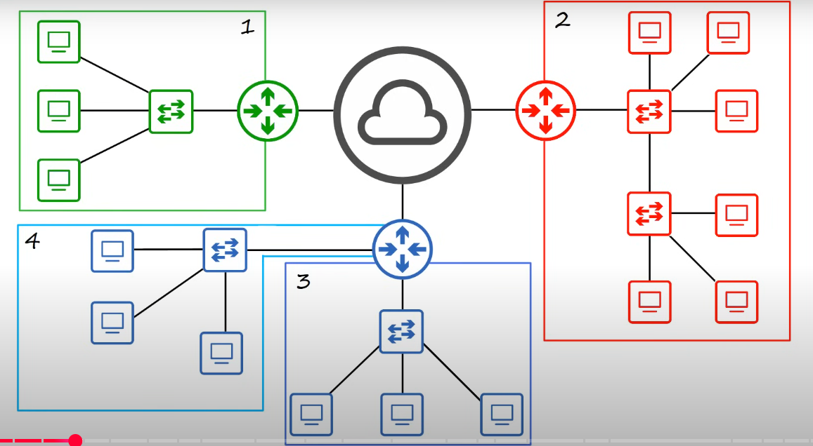

ဒီပုံက အင်တာနက်ကနေတဆင့် Network Devices တွေ ဘယ်လိုအလုပ်လုပ်တယ်ဆိုတာကို ကောင်းကောင်းကြီး ပုံဖော်ပြသပေးထားပါတယ်။

ဒီပုံမှာ Network ဖွဲ့စည်းပုံရဲ့ အဓိက အစိတ်အပိုင်း (၃) ခုကို မြင်တွေ့နိုင်ပါတယ်။

1.  **Central Cloud (အလယ်က တိမ်ပုံ):** ဒါဟာ **Internet** ဒါမှမဟုတ် **WAN (Wide Area Network)** ကို ကိုယ်စားပြုပါတယ်။ ကမ္ဘာအနှံ့အပြားက Network တွေကို ချိတ်ဆက်ပေးတဲ့ Public Network ဖြစ်ပါတယ်။
2.  **Routers (စက်ဝိုင်းပုံ မြှား ၄ ခုပါတဲ့ပုံ):** ပုံမှာပါတဲ့ အစိမ်း၊ အနီ၊ အပြာရောင်တွေနဲ့ ကွဲပြားနေတဲ့ Router တွေဟာ **LAN (Local Area Network)** တစ်ခုစီကို ကိုယ်စားပြုပါတယ်။ Router တွေဟာ မတူညီတဲ့ Network တွေကို အချင်းချင်း ချိတ်ဆက်ပေးတဲ့ Device တွေဖြစ်ပါတယ်။
3.  **Switches and PCs (မြှား ၂ ခုပါတဲ့ပုံနဲ့ လေးထောင့်ပုံ):** ဒါတွေကတော့ LAN တစ်ခုစီရဲ့ အတွင်းပိုင်းဖွဲ့စည်းပုံကို ပြသနေတာဖြစ်ပါတယ်။ Switch တွေက PC တွေကို အချင်းချင်း ချိတ်ဆက်ပေးထားတာဖြစ်ပါတယ်။

### **ပုံရဲ့ Process ရှင်းလင်းချက်**

ဒီပုံကို အဓိက အဆင့် (၂) ဆင့်ခွဲပြီး ရှင်းပြနိုင်ပါတယ်။

#### **အဆင့် ၁။ LAN အတွင်း ဆက်သွယ်မှု (Intra-LAN Communication)**

- **ဘယ်လိုအလုပ်လုပ်လဲ:** ပုံမှာပြထားတဲ့ အစိမ်းရောင်နယ်ပယ် (1) အတွင်းမှာရှိတဲ့ PC တစ်ခုက တခြား PC တစ်ခုကို Data ပို့ချင်တယ်ဆိုပါစို့။
- **လုပ်ဆောင်ပုံ:**
  1.  PC ကနေ ထွက်လာတဲ့ Data ဟာ **Switch** ဆီကို အရင်ဆုံးရောက်ပါတယ်။
  2.  Switch က Data Frame ရဲ့ **MAC Address** ကိုကြည့်ပြီး Destination PC က ဘယ် Port မှာ ချိတ်ထားတယ်ဆိုတာကို သိပါတယ်။
  3.  Switch က Data ကို **သက်ဆိုင်ရာ Destination PC ဆီကိုသာ တိုက်ရိုက်ပို့** ပေးပါတယ်။
- **နိဂုံးချုပ်:** LAN တစ်ခုအတွင်းမှာရှိတဲ့ Devices တွေ ဆက်သွယ်တဲ့အခါ **Switch** က အဓိက တာဝန်ယူပါတယ်။

#### **အဆင့် ၂။ LAN များကြား ဆက်သွယ်မှု (Inter-LAN Communication)**

- **ဘယ်လိုအလုပ်လုပ်လဲ:** အစိမ်းရောင်နယ်ပယ် (1) မှာရှိတဲ့ PC တစ်ခုက အနီရောင်နယ်ပယ် (2) မှာရှိတဲ့ PC ကို Data ပို့ချင်တယ်ဆိုပါစို့။
- **လုပ်ဆောင်ပုံ:**
  1.  PC ကနေ ထွက်လာတဲ့ Data ဟာ Local LAN (1) ရဲ့ **Switch** ကို အရင်ဆုံးရောက်ပါတယ်။
  2.  Switch က Destination PC ရဲ့ MAC Address ကို သူ့ရဲ့ MAC Address Table မှာ ရှာမတွေ့တဲ့အတွက် **LAN 1 ရဲ့ Router** ဆီကို Data Packet ကို ပို့ပေးလိုက်ပါတယ်။
  3.  Router ဟာ Data Packet ရဲ့ **Destination IP Address** ကိုကြည့်ပြီး Destination PC က တခြား Network (LAN 2) မှာ ရှိနေတယ်ဆိုတာကို ဆုံးဖြတ်ပါတယ်။
  4.  Router ဟာ Data Packet ကို **Internet (Cloud)** ကနေတဆင့် Destination Network (LAN 2) ရဲ့ Router ဆီကို လမ်းကြောင်းရှာပြီး ပို့ပေးပါတယ်။
  5.  LAN 2 ရဲ့ Router က Data Packet ကို လက်ခံပြီး LAN 2 အတွင်းက **Switch** ကို ပို့ပေးပါတယ်။
  6.  Switch က Data Packet ကို **သက်ဆိုင်ရာ PC ဆီကို တိုက်ရိုက်ပို့** ပေးလိုက်ပါတယ်။
- **နိဂုံးချုပ်:** မတူညီတဲ့ Networks တွေကြားမှာ ဆက်သွယ်တဲ့အခါ **Router** က အဓိက တာဝန်ယူပြီး Data တွေကို လမ်းကြောင်းရှာ ပို့ဆောင်ပေးပါတယ်။

ဒါကြောင့် ဒီပုံက **Switch တွေရဲ့ LAN အတွင်းက အခန်းကဏ္ဍ** နဲ့ **Router တွေရဲ့ Network များကြားက အခန်းကဏ္ဍ** ကို အလွန်ရှင်းလင်းစွာ ဖော်ပြပေးထားတဲ့ Diagram တစ်ခု ဖြစ်ပါတယ်ခင်ဗျာ။

# Data Sending

ဟုတ်ကဲ့ခင်ဗျာ။ သင်ပေးပို့လိုက်တဲ့ပုံနှစ်ခုကို ဆက်စပ်ပြီး Data Transfer လုပ်ပုံကို အသေးစိတ် ရှင်းပြပေးပါမယ်။

ဒီပုံနှစ်ခုဟာ Network မှာ Data တစ်ခုဘယ်လိုခရီးသွားတယ်ဆိုတာကို **Logical (အတွင်းပိုင်းလုပ်ဆောင်ချက်)** နဲ့ **Physical (ရုပ်ပိုင်းဆိုင်ရာ)** အပိုင်းဆိုပြီး ပြည့်ပြည့်စုံစုံ ဖော်ပြပေးထားပါတယ်ခင်ဗျာ။

### **၁။ Encapsulation (Logical Process) - `data_packet.png`**

ဒီပုံက Data ကို Network ပေါ်မှာ ပို့ဆောင်ဖို့အတွက် ဘယ်လိုပုံစံချပြီး ပြင်ဆင်လဲဆိုတာကို ပြသနေတာ ဖြစ်ပါတယ်။ ဒါကို **Encapsulation** လို့ခေါ်ပါတယ်။

- **Data:** မူလအချက်အလက် (ဥပမာ- Email Content) ဖြစ်ပါတယ်။
- **Data + L4 header:** Layer 4 (Transport Layer) ကိုရောက်တဲ့အခါ Data ရဲ့အရှေ့မှာ `L4 header` (TCP or UDP header) ကို ထည့်လိုက်ပါတယ်။
- **Data + L4 header + L3 header:** Layer 3 (Network Layer) ကိုရောက်တဲ့အခါ `L3 header` (IP header) ကို ထပ်ထည့်လိုက်ပါတယ်။
- **L2 trailer + Data + L4 header + L3 header + L2 header:** နောက်ဆုံး Layer 2 (Data Link Layer) ကိုရောက်တဲ့အခါမှာတော့ `L2 header` (MAC address ပါတဲ့ header) နဲ့ `L2 trailer` (error check လုပ်ဖို့ FCS trailer) တို့ကို ထည့်ပြီး Frame အဖြစ် အပြည့်အစုံ ထုပ်ပိုးလိုက်ပါတယ်။

### **၂။ Full-Duplex Transmission (Physical Process) - `fullduplex.jpg`**

ဒီပုံကတော့ Encapsulation လုပ်ပြီးသား Frame ကို Cable ကြိုးပေါ်ကနေ ဘယ်လို ပို့ဆောင်လဲဆိုတာကို ပြသနေတာ ဖြစ်ပါတယ်။

- **Full-Duplex:** ပုံမှာပြထားတဲ့အတိုင်း `Full-Duplex` ဆိုတာ Data ကို **တစ်ချိန်တည်းမှာ ပို့ခြင်း (Transmit) နဲ့ လက်ခံခြင်း (Receive) နှစ်မျိုးလုံးကို လုပ်ဆောင်နိုင်တဲ့** နည်းလမ်းကို ဆိုလိုပါတယ်။
- **Wires:** ပုံမှာ UTP (Unshielded Twisted Pair) Cable မှာရှိတဲ့ ကြိုးအတွဲတွေကို အသုံးပြုပုံကို ပြသထားပါတယ်။
  - `Pin 1` နဲ့ `2` တို့ဟာ Data ကို **ပို့ဆောင်ဖို့ (Transmit)** အတွက် သီးသန့် အသုံးပြုပါတယ်။
  - `Pin 3` နဲ့ `6` တို့ဟာ Data ကို **လက်ခံဖို့ (Receive)** အတွက် သီးသန့် အသုံးပြုပါတယ်။

### **ပုံနှစ်ခုကို ပေါင်းစပ်ပြီး ရှင်းပြခြင်း**

1.  **Logical Preparation:** ပထမပုံ (`data_packet.png`) မှာပြထားတဲ့အတိုင်း `Data` ကို Layers တွေဖြတ်ပြီး `L2 header` နဲ့ `L2 trailer` ထည့်ကာ Frame တစ်ခုအဖြစ် စနစ်တကျ ထုပ်ပိုးလိုက်ပါတယ်။
2.  **Physical Transmission:** အဲဒီ Frame ရဲ့ Digital Bits တွေကို Physical Layer (Layer 1) ကနေ `fullduplex.jpg` ပုံမှာပြထားတဲ့အတိုင်း Electrical Signal အဖြစ် ပြောင်းလဲလိုက်ပါတယ်။
3.  **Simultaneous Communication:** ပြီးနောက်မှာတော့ `Tx` အတွက်သီးသန့်ထားတဲ့ ကြိုးအတွဲ (Pin 1, 2) ကနေ Signal ကို ပို့ဆောင်လိုက်ပါတယ်။ တစ်ချိန်တည်းမှာပဲ တခြား Device တစ်ခုဆီက Signal ကို `Rx` အတွက်သီးသန့်ထားတဲ့ ကြိုးအတွဲ (Pin 3, 6) ကနေ လက်ခံနိုင်တာကြောင့် **တစ်ပြိုင်နက်တည်း အသွားအပြန် ဆက်သွယ်နိုင်တာ** ဖြစ်ပါတယ်။

အနှစ်ချုပ်ရရင် ပထမပုံက Data ရဲ့ အတွင်းပိုင်း ပုံစံချပုံကို ပြသပြီး၊ ဒုတိယပုံက အဲဒီပုံစံချထားတဲ့ Data တွေ ဘယ်လို Cable ကြိုးပေါ်ကနေ အသွားအပြန် အလုပ်လုပ်တယ်ဆိုတာကို ဖော်ပြပေးထားပါတယ်ခင်ဗျာ။
