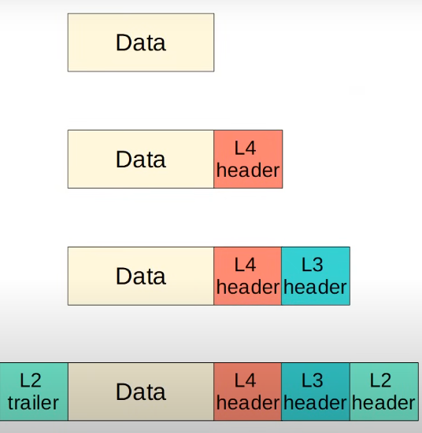

## Protocol Data Units (PDUs)

1.  **"Data"**:

    - ဒီအဆင့်ဟာ OSI Model ရဲ့ Layer 5, 6, 7 (Session, Presentation, Application) တွေမှာရှိတဲ့ အခြေခံအကျဆုံး PDU ဖြစ်ပါတယ်။
    - Network ကနေ ပို့ဆောင်ဖို့အတွက် Protocol Header တွေ မထည့်သွင်းရသေးတဲ့အတွက် ဒီအဆင့်မှာ Data လို့ပဲခေါ်ပါတယ်။

2.  **"Data + L4 header"**:

    - ဒါဟာ OSI Model ရဲ့ Layer 4 (Transport Layer) မှာရှိတဲ့ PDU ဖြစ်ပါတယ်။
    - Layer 4 Header (TCP or UDP header) ထည့်သွင်းပြီးသွားတဲ့အခါ ဒီ PDU ကို **`Segment`** လို့ခေါ်ပါတယ်။

3.  **"Data + L4 header + L3 header"**:

    - ဒါဟာ OSI Model ရဲ့ Layer 3 (Network Layer) မှာရှိတဲ့ PDU ဖြစ်ပါတယ်။
    - Layer 3 Header (IP header) ထည့်သွင်းပြီးသွားတဲ့အခါ ဒီ PDU ကို **`Packet`** လို့ခေါ်ပါတယ်။

4.  **"L2 trailer + Data + L4 header + L3 header + L2 header"**:
    - ဒါဟာ OSI Model ရဲ့ Layer 2 (Data Link Layer) မှာရှိတဲ့ PDU ဖြစ်ပါတယ်။
    - Layer 2 Header (MAC header) နဲ့ Layer 2 Trailer (FCS) တွေကို အကုန်ထည့်ပြီးသွားတဲ့အခါ ဒီ PDU ကို **`Frame`** လို့ခေါ်ပါတယ်။

### **အနှစ်ချုပ်:**

သင်ပေးပို့လိုက်တဲ့ပုံဟာ Data ကနေ Frame အဖြစ် ဘယ်လိုအဆင့်ဆင့် ပြောင်းလဲသွားလဲဆိုတဲ့ **Encapsulation Process** ကို အလွန်ကောင်းမွန်စွာ ပုံဖော်ထားပါတယ်။ ဒီလို အလွှာလိုက် ပုံစံချထားတဲ့ Data တစ်ခုချင်းစီကို **PDU (Protocol Data Unit)** လို့ ခေါ်ဆိုတာဖြစ်တဲ့အတွက်၊ သင်နားလည်ထားတဲ့အတိုင်း ဒီပုံဟာ PDU ပုံစံပဲ ဖြစ်ပါတယ်ခင်ဗျာ။
