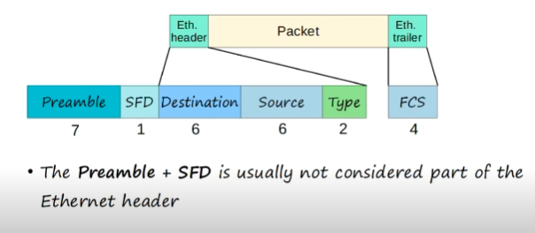

# Ethernet Frame

ပုံမှာပါတဲ့ `7 1 6 6 2 4` ဆိုတဲ့ဂဏန်းတွေဟာ Ethernet Frame ရဲ့ အစိတ်အပိုင်းတစ်ခုချင်းစီရဲ့ **အရွယ်အစား (Size)** ကို **Bytes** နဲ့ဖော်ပြပေးထားတာ ဖြစ်ပါတယ်။

ဒီအချက်အလက်တွေကို အသေးစိတ် ရှင်းပြပေးပါမယ်။

### **1. 7 (Preamble)**

- Preamble ဟာ **7 bytes** (56 bits) အရွယ်အစားရှိပါတယ်။
- ဒီ 7 bytes ကို အသုံးပြုပြီး Receiver နဲ့ Sender ရဲ့ Clock တွေကို အချိန်ကိုက်ညီအောင် (synchronize) လုပ်ဆောင်ပါတယ်။

### **2. 1 (SFD - Start of Frame Delimiter)**

- SFD ဟာ **1 byte** (8 bits) အရွယ်အစားရှိပါတယ်။
- SFD ရဲ့ `10101011` ဆိုတဲ့ Pattern က Preamble ပြီးဆုံးပြီး Data Frame ရဲ့ အစကို စတင်ပြီဆိုတာကို အတိအကျသတ်မှတ်ပေးပါတယ်။

### **3. 6 (Destination MAC Address)**

- Destination MAC Address ဟာ **6 bytes** (48 bits) အရွယ်အစားရှိပါတယ်။
- Frame ကို လက်ခံမယ့် Device ရဲ့ MAC Address ကို သယ်ဆောင်ထားပြီး Switch က Frame ကို သက်ဆိုင်ရာ Port ဆီကို တိုက်ရိုက်ပို့ဆောင်ပေးပါတယ်။

### **4. 6 (Source MAC Address)**

- Source MAC Address ဟာ **6 bytes** (48 bits) အရွယ်အစားရှိပါတယ်။
- Frame ကို ပို့လိုက်တဲ့ Device ရဲ့ MAC Address ကို သယ်ဆောင်ထားပြီး Switch က MAC Table ထဲမှာ ဘယ် Device ဟာ ဘယ် Port မှာ ရှိတယ်ဆိုတာကို မှတ်သားလေ့လာပါတယ်။

### **5. 2 (Type or Length)**

- Type or Length field ဟာ **2 bytes** (16 bits) အရွယ်အစားရှိပါတယ်။
- ဒီ Field က Payload (Packet) ထဲမှာ ဘယ်လို Network Layer Protocol အမျိုးအစား (ဥပမာ- IPv4, IPv6) ပါဝင်လာလဲဆိုတာကို သတ်မှတ်ပေးပါတယ်။

### **6. 4 (FCS - Frame Check Sequence)**

- FCS ဟာ **4 bytes** (32 bits) အရွယ်အစားရှိပါတယ်။
- FCS က CRC (Cyclic Redundancy Check) Algorithm ကို အသုံးပြုပြီး Data ရဲ့ Error (အမှားအယွင်း) ရှိ/မရှိကို စစ်ဆေးပေးပါတယ်။

### **အနှစ်ချုပ်**

`01_ethernet_frame.png` ပုံမှာပါတဲ့ `7 1 6 6 2 4` ဆိုတဲ့ဂဏန်းတွေဟာ Ethernet Frame တစ်ခုရဲ့ အစိတ်အပိုင်းတစ်ခုချင်းစီရဲ့ Bytes အရေအတွက်ကို စနစ်တကျဖော်ပြထားတာ ဖြစ်ပါတယ်ခင်ဗျာ။
