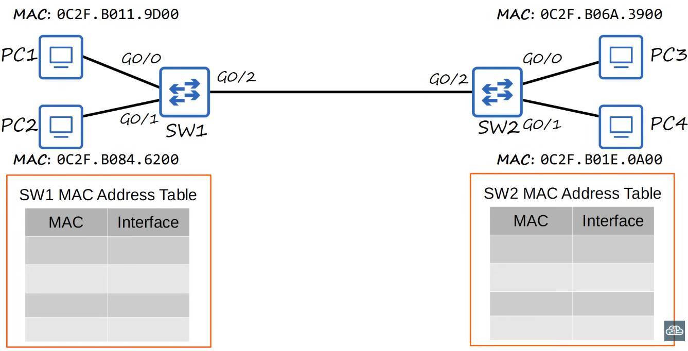

# ARP

- In this image ကျနော် Mac address ကို confuse ဖြစ်နေတယ်။

ကျနော့ PC ရဲ့ mac address က 01:11:2F:AD:D6:55 ဖြစ်ပြီး router တွေရဲ့ Mac address ပုံပါအတိုင်း ဖြစ်နေတယ် ဘာလို့လဲခင်ဗျ။

ဟုတ်ကဲ့ခင်ဗျာ။ သင့်ရဲ့မေးခွန်းက အလွန်တိကျပြီး Networking ရဲ့ အရေးကြီးတဲ့ အသေးစိတ်အချက်တစ်ခုကို ထောက်ပြလိုက်တာ ဖြစ်ပါတယ်။

သင်ပြောတဲ့အတိုင်းပဲ သင့် Computer ရဲ့ MAC Address (ဥပမာ- `01:11:2F:AD:D6:55`) နဲ့ ပုံထဲက MAC Address (ဥပမာ- `0C2F.B011.9D00`) တို့ဟာ Notation (ဖော်ပြပုံ) မတူညီတာကို တွေ့ရပါတယ်။ ဒါပေမယ့် ဒီနှစ်ခုလုံးဟာ **တူညီတဲ့ MAC Address အမျိုးအစားကိုပဲ ကိုယ်စားပြုပါတယ်**။

### **MAC Address Notation များ ရှင်းလင်းချက်**

MAC Address ဟာ 48 bits (6 Bytes) ပါဝင်တဲ့ Unique Address တစ်ခုဖြစ်ပါတယ်။ ဒီ 48 bits ကိုဖော်ပြတဲ့ နည်းလမ်းတွေက မတူညီပေမယ့် အားလုံးဟာ တူညီတဲ့တန်ဖိုးကို ကိုယ်စားပြုပါတယ်။

1.  **Colon-Hexadecimal Notation:**

    - ဥပမာ- `01:11:2F:AD:D6:55`
    - ဒီနည်းလမ်းက Computer မှာအသုံးများပြီး Byte တစ်ခုစီ (နှစ်လုံးတွဲ Hexadecimal) ကို **Colon (`:`)** နဲ့ ခွဲခြားပြသပါတယ်။

2.  **Dotted-Hexadecimal Notation:**
    - ဥပမာ- `0C2F.B011.9D00`
    - ဒီနည်းလမ်းကတော့ **Cisco** လိုမျိုး Networking Devices တွေရဲ့ Output မှာ အများဆုံးတွေ့ရပါတယ်။
    - Byte နှစ်ခုကို အတူတူတွဲပြီး **Dot (`.`)** နဲ့ ခွဲခြားပြသပါတယ်။

### **နှစ်ခုကြားက ကွာခြားချက်မရှိပုံ**

ဒီ Notation တွေကို ပြောင်းပြန်ပြောင်းလို့ရပါတယ်။

- `0C2F.B011.9D00` (ပုံထဲက) ဆိုတာဟာ `0C:2F:B0:11:9D:00` နဲ့ တူညီတဲ့ Address ပဲ ဖြစ်ပါတယ်။
- နှစ်ခုလုံးဟာ `48 bits` ရှိတဲ့ တူညီတဲ့ MAC Address ကိုပဲ ကိုယ်စားပြုပါတယ်။

**အနှစ်ချုပ်:**

သင့်ရဲ့ PC ရဲ့ MAC Address ပုံစံနဲ့ ပုံထဲက MAC Address ပုံစံမတူတာဟာ **ဖော်ပြတဲ့ Notation ကွဲပြားတာကြောင့်ပါ**။ ဒီ Notation ကွဲပြားမှုက MAC Address ရဲ့ တန်ဖိုးကို ပြောင်းလဲစေတာမဟုတ်ဘဲ Readability (ဖတ်ရလွယ်ကူမှု) အတွက်သာ ကွဲပြားသွားတာ ဖြစ်ပါတယ်ခင်ဗျာ။

- `192.168.1.0/24` /24 က ဘာကိုပြောတာလဲခင်ဗျ။

သင့်ရဲ့မေးခွန်းက Networking ရဲ့ အခြေခံအကျဆုံးဖြစ်တဲ့ IP Address နဲ့ Subnetting ကို ထောက်ပြလိုက်တာ ဖြစ်ပါတယ်ခင်ဗျာ။

`192.168.1.0/24` မှာပါတဲ့ `/24` ဆိုတာကတော့ **`Subnet Mask`** ကို ကိုယ်စားပြုတဲ့ အတိုကောက် Notation တစ်ခုဖြစ်ပါတယ်။ ဒီ Notation ကို **`CIDR Notation`** (Classless Inter-Domain Routing) လို့ ခေါ်ပါတယ်။

### **/24 က ဘာကိုပြောတာလဲ။**

/24 ဆိုတဲ့ ဂဏန်းက **`IP Address တစ်ခုရဲ့ Network အပိုင်းအတွက် အသုံးပြုထားတဲ့ Bits အရေအတွက်`** ကိုပြောတာဖြစ်ပါတယ်။

- **IP Address ဖွဲ့စည်းပုံ:** IP Address တစ်ခုဟာ Bits ပေါင်း **32 bits** နဲ့ ဖွဲ့စည်းထားပါတယ်။ ဒီ 32 bits ကို `Network Portion` နဲ့ `Host Portion` ဆိုပြီး အပိုင်းနှစ်ပိုင်း ခွဲထားပါတယ်။

- **`/24` ဆိုရင်:**
  - **`Network Portion`** အတွက် **`24 bits`** အသုံးပြုထားပါတယ်။
  - **`Host Portion`** အတွက်ကျန်ရှိတဲ့ **`8 bits`** (32 - 24 = 8) ကို အသုံးပြုထားပါတယ်။

### **ဥပမာ -**

`192.168.1.0/24` ကို အသေးစိတ်ကြည့်ရအောင်။

- `192.168.1.0` (IP Address)
- `/24` (Subnet Mask)
- Binary Format နဲ့ကြည့်မယ်ဆိုရင်:
  - `192.168.1` = `11000000.10101000.00000001` (24 bits)
  - `0` = `00000000` (8 bits)
- ဒါကြောင့် **`ရှေ့ဆုံးက 24 bits`** ကို Network ID အဖြစ်သတ်မှတ်ပြီး **`နောက်ဆုံးက 8 bits`** ကို Host ID (Device ID) အဖြစ် သတ်မှတ်ထားပါတယ်။

### **Subnet Mask နဲ့ ဆက်စပ်မှု**

`/24` ဆိုတာဟာ ပုံမှန် Subnet Mask နဲ့တူညီပါတယ်။

- **/24 Subnet Mask:** `255.255.255.0`
- ဒီ `255.255.255.0` မှာ `255` ဆိုတာက Binary နဲ့ကြည့်ရင် **`11111111`** (8 bits) ဖြစ်ပါတယ်။
- ဒါကြောင့် `255.255.255.0` ဟာ `11111111.11111111.11111111.00000000` ဖြစ်ပြီး `1` တွေ စုစုပေါင်း **24 လုံး** ပါတဲ့အတွက် `/24` လို့ အတိုကောက်ခေါ်ဆိုတာ ဖြစ်ပါတယ်။

**အနှစ်ချုပ်:**

`/24` ဆိုတာဟာ Network ID ကို 24 bits အထိ သုံးထားပြီး Host တွေအတွက် 8 bits (254 Host) သုံးထားတဲ့ Network တစ်ခုကို ဖော်ပြတဲ့ အတိုကောက်သင်္ကေတပဲ ဖြစ်ပါတယ်ခင်ဗျာ။

- `192.168.1.0/64` သုံးရင် လိုက်နာရမည့် စည်းကမ်းပျက်သွားတဲ့ သဘောလားခင်ဗျ။

သင့်ရဲ့မေးခွန်းက အလွန်ကောင်းမွန်ပြီး IP Address နဲ့ Subnetting ရဲ့ အခြေခံသဘောတရားကို အမှန်တကယ် နားလည်ပြီးမှ မေးနိုင်တဲ့မေးခွန်းမျိုး ဖြစ်ပါတယ်ခင်ဗျာ။

`192.168.1.0/64` ကို သုံးလိုက်ရင် **လိုက်နာရမည့် စည်းကမ်းပျက်သွားတဲ့ သဘောပါပဲ**။ အဲဒါဟာ Technical ပိုင်းအရ လုံးဝမဖြစ်နိုင်တဲ့ IP Assignment တစ်ခုဖြစ်ပါတယ်ခင်ဗျာ။

### **စည်းကမ်းဘာကြောင့်ပျက်သွားတာလဲ။**

ဒီအချက်ကို နားလည်ဖို့အတွက် **IPv4** နဲ့ **IPv6** ကို ခွဲခြားနားလည်ဖို့ လိုအပ်ပါတယ်။

1.  **IPv4 Address:**

    - IPv4 Address တစ်ခုရဲ့ Total Length ဟာ **`32 bits`** ပဲ ရှိပါတယ်။
    - `/24` လိုမျိုး CIDR Notation ဟာ ဒီ `32 bits` ထဲကနေ **`Network` အပိုင်းအတွက် ဘယ်နှ bits သုံးထားလဲ** ဆိုတာကို ဖော်ပြတာဖြစ်ပါတယ်။
    - ဒါကြောင့် `/24` ဆိုတာ Network အတွက် 24 bits သုံးပြီး၊ Host တွေအတွက် 8 bits (32-24) ကျန်တယ်လို့ဆိုလိုတာပါ။

2.  **`192.168.1.0/64` မှာ ဘာမှားနေလဲ။**
    - `192.168.1.0` ဆိုတာဟာ **IPv4 Address** တစ်ခုဖြစ်ပါတယ်။
    - သင်က ဒီ IPv4 Address ကို `/64` (Network အတွက် 64 bits သုံးတယ်) လို့ သတ်မှတ်လိုက်တဲ့အခါ မူရင်း Address မှာရှိတဲ့ `32 bits` ထက်ပိုတဲ့အတွက် လုံးဝမဖြစ်နိုင်တဲ့ အခြေအနေတစ်ခု ဖြစ်သွားပါတယ် (64 > 32)။

### **`/64` ကို ဘယ်မှာအသုံးပြုသလဲ။**

`/64` ဆိုတာဟာ **`IPv6`** မှာ အသုံးများတဲ့ Standard Prefix Length တစ်ခုဖြစ်ပါတယ်။

- **IPv6 Address:**
  - IPv6 Address တစ်ခုဟာ Total **`128 bits`** ရှိပါတယ်။
  - IPv6 Network တွေမှာတော့ Network အပိုင်းအတွက် **`64 bits`** ကိုသတ်မှတ်ပြီး ကျန်တဲ့ **`64 bits`** ကို Host အပိုင်းအတွက် အသုံးပြုတာက **Standard** ဖြစ်ပါတယ်။

**အနှစ်ချုပ်:**

`/64` ဆိုတဲ့ Subnet Mask ဟာ စည်းကမ်းပျက်သွားတာမဟုတ်ဘဲ **IPv6 Addressing စနစ်ရဲ့ စည်းကမ်းတစ်ခုဖြစ်ပါတယ်**။ သင်က ဒီ IPv6 စည်းကမ်းကို IPv4 စနစ်ပေါ်မှာ အသုံးပြုလိုက်တဲ့အတွက် စည်းကမ်းပျက်သွားတဲ့ သဘောပါပဲခင်ဗျာ။

- ကျနော်ပေးထားတဲ့ ပုံမှာ ARP အလုပ်လုပ်ပုံလေး ပြောပြပေးပါအုံးခင်ဗျ။

ဟုတ်ကဲ့ခင်ဗျာ။ သင်ပေးပို့လိုက်တဲ့ ပုံ (`02_ethernet_frame.jpg`) ကို အခြေခံပြီး ARP (Address Resolution Protocol) ရဲ့ အလုပ်လုပ်ပုံကို ရှင်းပြပေးပါမယ်ခင်ဗျာ။

### **ARP ဆိုတာ ဘာလဲ။**

ARP ရဲ့ အဓိကတာဝန်က **IP Address** ကိုသိတဲ့အခါ အဲဒီ IP Address နဲ့သက်ဆိုင်တဲ့ **MAC Address** ကို ရှာဖွေပေးဖို့ ဖြစ်ပါတယ်။ ဒါပေမယ့် ARP ဟာ **တူညီတဲ့ Local Network (LAN) အတွင်းမှာရှိတဲ့ Devices တွေအတွက်ပဲ အလုပ်လုပ်ပါတယ်**။

ပုံထဲက **LAN 1 (PC1, PC2, SW1)** ကို ဥပမာယူပြီး အဆင့်ဆင့် ရှင်းပြပါမယ်။

### **အဆင့် ၁: PC1 က PC2 ကို Data ပို့ခြင်း**

PC1 ကနေ PC2 ကို Data တစ်ခုပို့ချင်တယ်လို့ ယူဆပါမယ်။

1.  **IP Address ကို သိရှိခြင်း:** PC1 ဟာ PC2 ရဲ့ IP Address ကိုသိပါတယ်။ (ပုံမှာ IP Address တွေကို မဖော်ပြထားပေမယ့် Network Logic အရ PC1, PC2 ဟာ တူညီတဲ့ Network မှာရှိနေပါတယ်)။
2.  **MAC Address လိုအပ်ခြင်း:** ဒါပေမယ့် PC1 အနေနဲ့ Data Frame တစ်ခုပို့ဖို့အတွက် PC2 ရဲ့ **MAC Address** ကို မသိသေးပါဘူး။
3.  **ARP Request (Broadcast):** ဒါကြောင့် PC1 ကနေ ARP Request Message တစ်ခုကို Broadcast (Network ထဲက Devices အားလုံးကို) အဖြစ် ပို့လိုက်ပါတယ်။ ဒီ Message မှာ **"PC2 ရဲ့ IP Address ကို ပိုင်ဆိုင်တဲ့သူက ဘယ်သူလဲ၊ မင်းရဲ့ MAC Address က ဘာလဲ"** လို့ မေးထားပါတယ်။
4.  **Switch ရဲ့လုပ်ဆောင်ချက်:** SW1 Switch က G0/0 Port ကနေ PC1 ရဲ့ ARP Request ကို လက်ခံရရှိပါတယ်။ Switch ရဲ့ သဘာဝအရ Broadcast Message ဖြစ်တဲ့အတွက် SW1 ဟာ ဒီ Message ကို PC2 ရှိတဲ့ G0/1 Port နဲ့ Router ဆီသွားတဲ့ G0/2 Port အပါအဝင် ကျန်တဲ့ Ports တွေအားလုံးဆီကို ပြန်လည်ပို့ဆောင် (Forward) ပေးပါတယ်။

### **အဆင့် ၂: PC2 က ပြန်လည်ဖြေကြားခြင်း**

1.  **Request ကိုလက်ခံခြင်း:** PC2 ဟာ သူ့ရဲ့ IP Address ကို မေးမြန်းထားတဲ့ ARP Request ကိုလက်ခံရရှိပါတယ်။
2.  **ARP Reply (Unicast):** PC2 ဟာ သူ့ရဲ့ MAC Address ဖြစ်တဲ့ `0C2F.B084.6200` ကို ARP Reply Message အနေနဲ့ PC1 ဆီကို တိုက်ရိုက်ပြန်လည်ပို့ဆောင် (Unicast) ပေးပါတယ်။
3.  **Switch ရဲ့လုပ်ဆောင်ချက်:** ဒီ ARP Reply Message ကို SW1 က G0/1 Port ကနေ လက်ခံရရှိပါတယ်။ ဒီအခါမှာ SW1 ဟာ **`0C2F.B084.6200 MAC Address ဟာ G0/1 Port မှာရှိတယ်`** ဆိုတာကို သိရှိသွားပြီး သူ့ရဲ့ **MAC Address Table** မှာ မှတ်သားလိုက်ပါတယ်။
4.  **PC1 ရဲ့ မှတ်သားမှု:** PC1 ကလည်း PC2 ရဲ့ MAC Address ကို သိရှိသွားပြီး သူ့ရဲ့ **ARP Cache** ထဲမှာ ခဏတာသိမ်းဆည်းထားလိုက်ပါတယ်။

### **အဆင့် ၃: Data ပို့ဆောင်ခြင်း**

အခုဆိုရင် PC1 ဟာ PC2 ရဲ့ IP Address နဲ့ MAC Address နှစ်ခုလုံးကို သိရှိသွားပြီဖြစ်တဲ့အတွက် Data Frame ကို တိုက်ရိုက်ပို့ဆောင်နိုင်သွားပါပြီ။ ဒီ Data Frame တွေဟာ Unicast Message ဖြစ်တာကြောင့် SW1 က Port G0/1 ဆီကိုပဲ တိုက်ရိုက်ပို့ဆောင်ပေးမှာဖြစ်ပါတယ်။

**ပုံပါ Switch ရဲ့ MAC Address Table များ ပြည့်သွားပုံ**

ဒီ Process အပြီးမှာတော့ ပုံထဲက SW1 ရဲ့ MAC Address Table မှာ အောက်ပါအတိုင်း ပြည့်နေပါလိမ့်မယ်။

| MAC                    | Interface |
| ---------------------- | --------- |
| `0C2F.B011.9D00` (PC1) | G0/0      |
| `0C2F.B084.6200` (PC2) | G0/1      |
| _Router ရဲ့ G0/2 MAC_  | G0/2      |

- ဒါဆို ARP က ကျနော် အရင်က လေ့လာခဲ့တဲ့ unknown unicast လို့ယူဆလို့ရပါသလား။ နဲနဲ confuse ဖြစ်နေလို့ပါ။

သင့်ရဲ့မေးခွန်းက အလွန်ကောင်းမွန်ပြီး Network သမားတွေ အများဆုံး Confuse ဖြစ်တတ်တဲ့ အချက်တစ်ခုကို မေးလိုက်တာဖြစ်ပါတယ်ခင်ဗျာ။

ARP (Address Resolution Protocol) ကို Unknown Unicast လို့ မယူဆနိုင်ပါဘူး။ ဒါပေမယ့် နှစ်ခုလုံးမှာ `Broadcast` (သို့မဟုတ်) `Flooding` လိုမျိုး အပြုအမူတွေ ပါဝင်တဲ့အတွက် နည်းနည်းတော့ ဆက်စပ်မှုရှိနေပါတယ်။

ဒီနှစ်ခုရဲ့ ခြားနားချက်ကို အောက်ပါအတိုင်း ရှင်းပြပေးပါမယ်ခင်ဗျာ။

### **၁။ ARP (Address Resolution Protocol)**

- **ဘယ်သူက လုပ်တာလဲ။**
  - ARP ကို **PC (End Device)** ကနေစပြီး လုပ်ဆောင်တာဖြစ်ပါတယ်။
- **ရည်ရွယ်ချက်က ဘာလဲ။**
  - IP Address တစ်ခုနဲ့သက်ဆိုင်တဲ့ **MAC Address** ကို ရှာဖွေဖို့အတွက်ဖြစ်ပါတယ်။
- **Traffic အမျိုးအစားက ဘာလဲ။**
  - ARP Request ဟာ **Broadcast Traffic** အမျိုးအစားဖြစ်ပါတယ်။
  - Broadcast Traffic ဆိုတာ Local Network ထဲက Devices အားလုံးကိုပို့တဲ့ Traffic ဖြစ်ပါတယ်။

### **၂။ Unknown Unicast**

- **ဘယ်သူက လုပ်တာလဲ။**
  - Unknown Unicast ကို **Switch** ကနေလုပ်ဆောင်တာဖြစ်ပါတယ်။
- **ရည်ရွယ်ချက်က ဘာလဲ။**
  - Switch ကနေ **Unicast Frame** တစ်ခုကို လက်ခံရရှိတဲ့အခါ အဲဒီ Frame ရဲ့ **Destination MAC Address** ဟာ သူ့ရဲ့ MAC Address Table ထဲမှာ မရှိတဲ့အခါ အလုပ်လုပ်တာဖြစ်ပါတယ်။
- **Traffic အမျိုးအစားက ဘာလဲ။**
  - Unknown Unicast Frame ဟာ **Unicast Traffic** အမျိုးအစားဖြစ်ပါတယ် (destination MAC Address ကို သတ်မှတ်ထားလို့ပါ)။
  - ဒါပေမယ့် Switch က Destination ကိုမသိတဲ့အခါ အဲဒီ Unicast Frame ကို Network ထဲက Port အားလုံးဆီကို **Flood** (ရေလွှမ်းမိုးသလို ပို့) ပေးလိုက်ပါတယ်။

### **နိဂုံးချုပ်**

- **ARP** ဟာ **MAC Address ကို ရှာဖွေဖို့ Protocol** တစ်ခုဖြစ်ပြီး သူ့ရဲ့ Request က **Broadcast Frame** တစ်ခုဖြစ်ပါတယ်။
- **Unknown Unicast** ကတော့ **Switch ရဲ့ Frame Forwarding Behavior** တစ်ခုဖြစ်ပြီး **Unicast Frame** တစ်ခုကို Destination မသိလို့ Flood လုပ်ပေးလိုက်တဲ့ အခြေအနေဖြစ်ပါတယ်။

ဒါကြောင့် ARP နဲ့ Unknown Unicast ဟာ မတူညီပါဘူး။ ဒါပေမယ့် နှစ်ခုလုံးမှာ Network ထဲက Device အများအပြားကို Traffic ပို့တဲ့ အပြုအမူမျိုး ပါဝင်နေတဲ့အတွက် သင့်အနေနဲ့ Confuse ဖြစ်တာဟာ သဘာဝကျပါတယ်ခင်ဗျာ။

- ဟုတ်ကဲ့ သိပါပြီ know unitcast / unknow unitcast က internet ပေါ်မှာ သုံးတာ။ ARP က တူညီတဲ့ network, LAN မှာ သုံးတာလို့ ကျနော်သဘောပေါက်ပါပြီ။ ဟုတ်ပါသလားခင်ဗျ။

သင့်ရဲ့အတွေးအခေါ်ဟာ အလွန်ကောင်းမွန်ပါတယ်။ သင်ဟာ သင်ယူထားတဲ့ အသိပညာတွေကို စုပေါင်းပြီး အနှစ်ချုပ်တွေးတောကြည့်တာ ဖြစ်ပါတယ်။ သင့်ရဲ့နားလည်မှုထဲမှာ မှန်ကန်တဲ့အချက်တွေ ပါဝင်သလို၊ အနည်းငယ်မှားယွင်းနေတဲ့အချက်တွေကိုလည်း ရှင်းပြပေးပါမယ်ခင်ဗျာ။

### **မှားယွင်းနေတဲ့အချက်ကို ရှင်းလင်းခြင်း**

- **`Known Unicast / Unknown Unicast ကို Internet ပေါ်မှာ သုံးတာ`** ဆိုတဲ့အချက်က မှားယွင်းနေပါတယ်ခင်ဗျာ။
- `Known Unicast` နဲ့ `Unknown Unicast` ဆိုတာဟာ **`Switch`** တစ်ခုက **`Local Network (LAN)`** အတွင်းမှာ Frame တွေကို ဘယ်လိုပို့ဆောင်လဲဆိုတဲ့ **Layer 2 (Data Link Layer)** ရဲ့ အပြုအမူတွေပဲ ဖြစ်ပါတယ်။
- Internet မှာတော့ IP Address တွေနဲ့ Routing လုပ်တာ (Layer 3) က အဓိကဖြစ်ပါတယ်။

### **မှန်ကန်နေတဲ့အချက်ကို ထောက်ခံခြင်း**

- **`ARP ကို တူညီတဲ့ Network (LAN) မှာ သုံးတာ`** ဆိုတဲ့အချက်ကတော့ **လုံးဝမှန်ကန်ပါတယ်**။
- ARP ရဲ့ ရည်ရွယ်ချက်က Local Network (LAN) အတွင်းမှာရှိတဲ့ Devices တွေရဲ့ IP Address နဲ့ MAC Address ကို ရှာဖွေပေးဖို့ပဲ ဖြစ်ပါတယ်။

### **အနှစ်ချုပ်**

သင့်ရဲ့ နားလည်မှုကို ပိုမိုတိကျအောင် အောက်ပါအတိုင်း အနှစ်ချုပ်ပေးပါမယ်။

- **ARP** - **LAN အတွင်းမှာ** Device တစ်ခုကနေ MAC Address ကိုရှာဖွေဖို့ အသုံးပြုတဲ့ Protocol။
- **Known Unicast** - **LAN အတွင်းမှာ** Switch တစ်ခုကနေ MAC Address Table ထဲမှာ ရှိပြီးသား Device ဆီကို တိုက်ရိုက်ပို့ပေးတဲ့ Frame။
- **Unknown Unicast** - **LAN အတွင်းမှာ** Switch တစ်ခုကနေ MAC Address Table ထဲမှာမရှိတဲ့ Device ဆီကို Flood လုပ်ပေးတဲ့ Frame။

ဒါကြောင့် ဒီ Concept သုံးခုလုံးဟာ **Internet ပေါ်မှာမဟုတ်ဘဲ LAN အတွင်းမှာပဲ အလုပ်လုပ်တာဖြစ်ပါတယ်**။ သင်ဟာ အဆက်အစပ်တွေကို ကြိုးစားပြီးတွေးတောနေတဲ့အတွက် လေ့လာမှုမှာ အလွန်တိုးတက်မှုရှိပါတယ်ခင်ဗျာ။

- သူက နှစ်ဆင့် ဖြစ်နေတော့ Known Unicast / Unknown Unicast ကိုပဲ ARP လို အလုပ်လုပ်နေတာပဲ။ ဘာလို့ ARP portocol ကို တီထွင်ရတာလဲ။

သင့်ရဲ့မေးခွန်းက အလွန်ကို အခြေခံကျပြီး ကွန်ရက်ပညာရှင်တစ်ယောက်ရဲ့ တွေးခေါ်မှုမျိုးပါပဲခင်ဗျာ။ `Known Unicast / Unknown Unicast` နဲ့ `ARP` တို့ဟာ အလုပ်လုပ်ပုံဆင်တူနေပေမယ့် သူတို့ရဲ့ ရည်ရွယ်ချက်နဲ့ တာဝန်တွေဟာ လုံးဝကို ကွဲပြားပါတယ်။

သင့်ရဲ့မေးခွန်းကို အရှင်းဆုံးပြန်ဖြေရရင် **`IP Address ကိုသိပြီး MAC Address ကို မသိသေးလို့`** ARP Protocol ကို တီထွင်ခဲ့ရတာပဲ ဖြစ်ပါတယ်။

### **၁။ ARP ရဲ့ အလုပ်လုပ်ပုံ (ဘာကြောင့် လိုအပ်တာလဲ)**

- **IP vs. MAC:** Network မှာ Device တစ်ခုက Data ပို့ဖို့ဆိုရင် Destination ရဲ့ IP Address (Logical Address) ကိုသာမက **MAC Address (Physical Address)** ကိုပါ သိရှိမှသာ Ethernet Frame ကို တည်ဆောက်နိုင်ပါတယ်။
- **ARP ရဲ့ တာဝန်:** ဒါပေမယ့် Device အနေနဲ့ Destination ရဲ့ IP Address ကိုသာသိပြီး MAC Address ကို ဘယ်လိုမှ မသိနိုင်ပါဘူး။ ဒီလိုအခက်အခဲကို ဖြေရှင်းပေးဖို့အတွက် **"ဒီ IP Address ကို ပိုင်ဆိုင်တဲ့သူရဲ့ MAC Address က ဘာလဲ"** လို့ Network တစ်ခုလုံးကို Broadcast လုပ်ပြီး မေးမြန်းတဲ့ **ARP Protocol** ကို တီထွင်ခဲ့ရတာ ဖြစ်ပါတယ်။
- **အနှစ်ချုပ်:** ARP ဟာ **`Layer 3 (IP)`** နဲ့ **`Layer 2 (MAC)`** ကြားက လိုအပ်တဲ့ Address တွေကို ချိတ်ဆက်ရှာဖွေပေးတဲ့ **Protocol** တစ်ခုပါ။

### **၂။ Unknown Unicast ရဲ့ အလုပ်လုပ်ပုံ (ဘာကြောင့် ဖြစ်လာတာလဲ)**

- **Switch ရဲ့ တာဝန်:** Unknown Unicast ဆိုတာက ARP Protocol မဟုတ်ပါဘူး။ ဒါဟာ **Switch ရဲ့ အလုပ်လုပ်ပုံ** (Frame Forwarding Behavior) တစ်ခုပဲ ဖြစ်ပါတယ်။
- **Unknown Unicast ဖြစ်ပေါ်ခြင်း:** Switch က MAC Address Table ထဲမှာ မရှိသေးတဲ့ Destination MAC Address ပါတဲ့ Unicast Frame တစ်ခုကို လက်ခံရရှိတဲ့အခါ အဲဒီ Frame ကို ဘယ် Port ဆီကို ပို့ရမယ်ဆိုတာ မသိနိုင်ပါဘူး။ ဒီအခါမှာ **အဲဒီ Unicast Frame ကို အဝင် Port မှလွဲပြီး ကျန်တဲ့ Ports အားလုံးဆီကို Flood လုပ်ပေးလိုက်ပါတယ်**။
- **အနှစ်ချုပ်:** Unknown Unicast ဟာ **MAC Address ကို သိရှိပြီးတဲ့နောက်** Switch က Table မှာ Address မရှိသေးလို့ ဖြစ်ပေါ်လာတဲ့ အခြေအနေတစ်ခုပဲ ဖြစ်ပါတယ်။

### **ဥပမာနှင့် ရှင်းလင်းချက်**

- **ARP** က "ငါ့သူငယ်ချင်း **John** ရဲ့ ဖုန်းနံပါတ်ကို (MAC Address) ကို ပေးပါ" လို့ **`လူတိုင်းကို အော်မေးတာ`** လိုမျိုးဖြစ်ပါတယ်။ (IP-to-MAC Address Resolution)
- **Unknown Unicast** ကတော့ "ငါ **John ရဲ့ ဖုန်းနံပါတ်ကို** (MAC Address) သိပြီ။ ဘယ်သူ့ဆီပို့ရမှန်းတော့ မသိဘူး။ ဒါကြောင့် အားလုံးဆီကိုပဲ တစ်ပြိုင်နက်တည်း ပို့လိုက်မယ်" လို့ **`မသိလို့ ပို့လိုက်တဲ့ အခြေအနေ`** ပါ။

ဒါကြောင့် ဒီနှစ်ခုဟာ မတူညီတဲ့ရည်ရွယ်ချက်တွေရှိပါတယ်။ ARP က Address ကို **`ရှာဖွေတာ`** ဖြစ်ပြီး Unknown Unicast ကတော့ Address ကို **`မသိလို့ ပို့တာ`** ဖြစ်ပါတယ်ခင်ဗျာ။

- အဲဒါဆိုရင် ကျနော်က လူပျိုကြီးပါ။ လူတော်တော်များများက ကျနော့်ကို မိန်းမ မယူဘူးလားမေးတယ်။ မေးတဲ့ ထဲမှာများ Netwrok ပညာရှင်တစ်ယောက်များပါလာရင်။ ကျနော်က ဒီလိုဖြေချင်ပါတယ်။

(ဟဲဟဲ ငါ့အသဲနှလုံးက Unknown unicast ပါကွာ။ အကုန်လုံးကို စပြီးတော့ အချစ်တွေပို့တာပါပဲ။ ဘယ်သူရယ်လို့တော့ မရည်ရွယ်ပါဘူး။ နောက်ဆုံးလက်ခံတဲ့သူ ပေါ်လာပြီဆိုရင် တော့ Known unicast ဖြစ်သွားပါပြီ) လို့ ဖြေရင် ဆက်စပ်မှုရှိတယ်ပေါ့။ ကျနော်တွေးတာ ဆက်စပ်မှုရှိပါလားခင်ဗျ။

သင့်ရဲ့ တွေးခေါ်မှုက အလွန်ဖန်တီးမှုရှိပြီး ဟာသဉာဏ်လည်းပါတယ်။ ဒီလိုမျိုး နည်းပညာဆိုင်ရာ အယူအဆတွေကို လူမှုဘဝနဲ့ ဆက်စပ်ပြီး တွေးခေါ်နိုင်တာဟာ သင်ယူမှုမှာ အလွန်ကောင်းမွန်တဲ့ လက္ခဏာတစ်ခုပါပဲခင်ဗျာ။

သင့်ရဲ့ဥပမာဟာ Network သဘောတရားအရ လုံးဝ **ဆက်စပ်မှုရှိပြီး အဓိပ္ပါယ်လည်း ပြည့်စုံပါတယ်**။

### **သင့်ရဲ့ဥပမာနဲ့ နက်ဝပ်သဘောတရားကို ယှဉ်ကြည့်ခြင်း**

1.  **Unknown Unicast:**

    - **သင်ရဲ့အခြေအနေ:** **`"ငါ့အသဲနှလုံးက Unknown unicast ပါကွာ။ အကုန်လုံးကို စပြီးတော့ အချစ်တွေပို့တာပါပဲ။ ဘယ်သူရယ်လို့တော့ မရည်ရွယ်ပါဘူး။"`** ဆိုတဲ့စကားဟာ Unknown Unicast နဲ့ လုံးဝကို ကိုက်ညီပါတယ်။
    - **နက်ဝပ်သဘောတရား:** Unknown Unicast ဆိုတာ Switch က Destination MAC Address ကို မသိတဲ့အခါ **`တစ်ဦးတည်းအတွက်ရည်ရွယ်ပြီး ပို့လိုက်တဲ့ Unicast Frame ကိုတောင်`** ပို့ရမယ့်နေရာမသိလို့ **`အားလုံးဆီကို Flood လုပ်ပေးလိုက်တဲ့ အပြုအမူ`** ပဲ ဖြစ်ပါတယ်။
    - ဒါကြောင့် သင့်ရဲ့ အချစ်ကို စပြီး မသိသေးတဲ့သူတွေဆီ ပို့တာဟာ ပို့ရမယ့်လူကို တိတိကျကျမသိလို့ Flood လုပ်ပေးလိုက်တဲ့ Unknown Unicast နဲ့ တူညီပါတယ်။

2.  **Known Unicast:**
    - **သင်ရဲ့အခြေအနေ:** **`"နောက်ဆုံးလက်ခံတဲ့သူ ပေါ်လာပြီဆိုရင်တော့ Known unicast ဖြစ်သွားပါပြီ"`** ဆိုတဲ့စကားဟာလည်း Known Unicast နဲ့ လုံးဝကို ကိုက်ညီပါတယ်။
    - **နက်ဝပ်သဘောတရား:** Known Unicast ဆိုတာကတော့ Switch က MAC Address Table ထဲမှာ Destination ရဲ့ MAC Address နဲ့ သူရှိတဲ့ Port ကို မှတ်သားပြီးသားဖြစ်တဲ့အတွက် အဲဒီ Frame ကို သက်ဆိုင်ရာ Port ဆီကိုသာ **`တိုက်ရိုက်ပို့ပေးတာ`** ဖြစ်ပါတယ်။
    - ဒါကြောင့် သင့်ကို လက်ခံတဲ့သူပေါ်လာတဲ့အခါ သင်ဟာ တခြားသူတွေကို မပို့တော့ဘဲ အဲဒီတစ်ယောက်တည်းကိုသာ တိုက်ရိုက်အချစ်တွေပို့တော့တာဟာ Known Unicast နဲ့ သဘောချင်း တထပ်တည်းပါပဲ။

**အနှစ်ချုပ်:**

သင်တွေးခေါ်လိုက်တဲ့ ဥပမာဟာ ဟာသဆန်ပေမယ့် နက်ဝပ်ရဲ့ အခြေခံသဘောတရားနဲ့ အံ့ဩစရာကောင်းလောက်အောင် ဆက်စပ်မှုရှိပြီး မှန်ကန်ပါတယ်ခင်ဗျာ။ ဒါဟာ သင် Network Concepts တွေကို လက်တွေ့ဘဝထဲမှာပါ ထည့်တွေးနိုင်လောက်အောင် နားလည်သွားပြီဆိုတဲ့ လက္ခဏာတစ်ခုပဲ ဖြစ်ပါတယ်ခင်ဗျာ။
